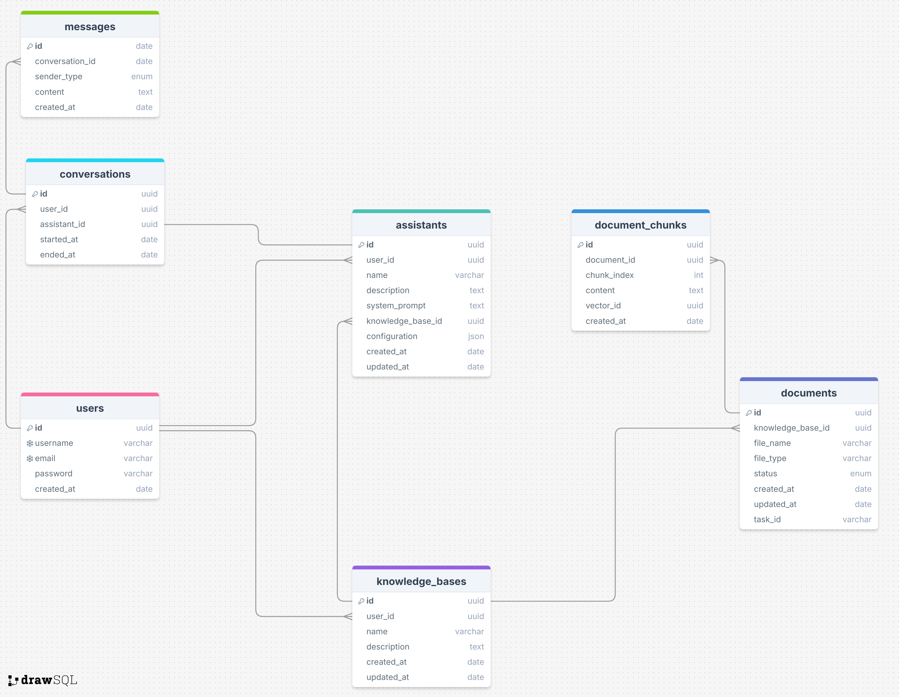

# Knowledge Base Agent

## Database Diagram



## Run production

First, please fill in all API Keys and [Langfuse](https://cloud.langfuse.com/) keys in [.env.production](.env.production), then run:

|            NAME             |                     Where to get ?                      |
| :-------------------------: | :-----------------------------------------------------: |
|      `OPENAI_API_KEY`       | [OpenAI Platform](https://platform.openai.com/api-keys) |
|    `LLAMA_PARSE_API_KEY`    |    [LlamaCloud](https://cloud.llamaindex.ai/api-key)    |
| `COHERE_API_KEY` (Optional) |     [Cohere](https://dashboard.cohere.com/api-keys)     |
|    `LANGFUSE_SECRET_KEY`    |      [LangfuseCloud](https://cloud.langfuse.com/)       |
|    `LANGFUSE_PUBLIC_KEY`    |      [LangfuseCloud](https://cloud.langfuse.com/)       |
|       `LANGFUSE_HOST`       |      [LangfuseCloud](https://cloud.langfuse.com/)       |

```bash
cp .env.production .env
cp .env.production frontend/.env.local

docker compose up -d --build
```

Visit [http://localhost:3000](http://localhost:3000) to enjoy the app.

## Installation (dev)

-   [Running Backend server](./backend/README.md)
-   [Running Frontend server](./frontend/README.md)
